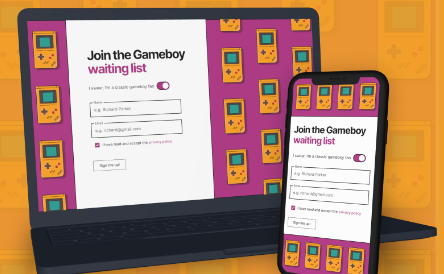
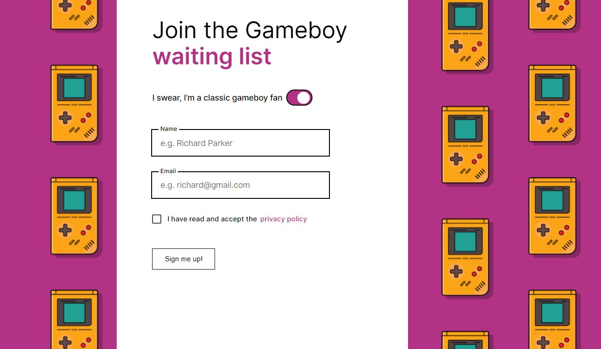
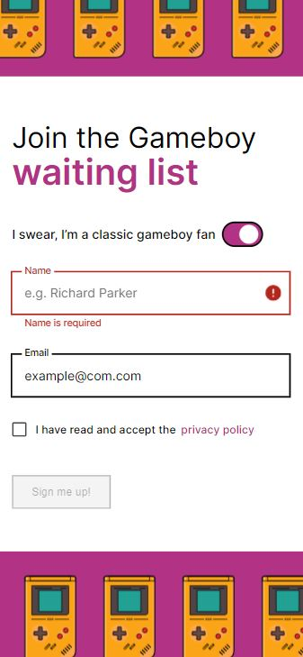

<h1 align="center">
  Lead Collector
  <p align="center">
    
  </p>
</h1>
<p align="center">
  <a href="#introduction">Introduction</a> •
  <a href="#features">Features</a> •
  <a href="#technologies">Technologies</a> •
  <a href="#getting-started">Getting Started</a> •
  <a href="#testing">Testing</a> •
  <a href="#live-demo">Live Demo</a> •
  <a href="#screenshots">Screenshots</a> •
  <a href="#credits">Credits</a>
</p>
<br><br><br>

## Introduction

Lead Collector is a simple yet effective landing page designed for efficient data collection from visitors. It's built with Gatsby.js to ensure SEO-friendly performance and offers a great user experience. This project allows you to gather crucial visitor information such as emails and names, which can later be utilized in other projects for display in tables and charts.
<br><br>

## Features

**· Form Submission:** Effortlessly collect visitor data like email and name.

**· SEO-Friendly :** Optimized for search engines for higher visibility.

**· Fast Load Times:** Gatsby.js ensures quick loading for a smoother user experience.

**· Modular Design:** Utilizes components from the <a href="https://github.com/wawrzonnn/ui-system">Nerdux-UI</a> system for consistency and modularity.
<br><br>

## Technologies

**·React.js**

**·TypeScript**

**·SCSS Modules**

**·Gatsby.js**

**·Jest**

<br><br>

## Getting Started

**1. Clone the Repository**

```bash
https://github.com/wawrzonnn/lead-collector.git
```

**2. Install Dependencies**

```bash
npm install
```

**3. Run the Application**

```bash
npm run start
```

Visit **http://localhost:8000/** to view the component library.
<br><br>

## Testing

**· Run Tests**

```bash
npm run test
```

Tests are written using Jest and React Testing Library to ensure component reliability and functionality.
<br><br>

## Live Demo

Experience Lead Collector in action: [Live Demo Link](https://lead-collector-black.vercel.app/)
<br><br>

## Screenshots

#### ◇ Full Screen

<p align="center">
  <a href="./docs/lead1Big.png">
    
  </a>
</p>

#### ◇ Mobile Screen

<p align="center">
  <a href="./docs/lead2Small.jpg">
    
  </a>
</p>

<br><br>

## Credits

Design provided by [Nerdbord.io](https://nerdbord.io).
